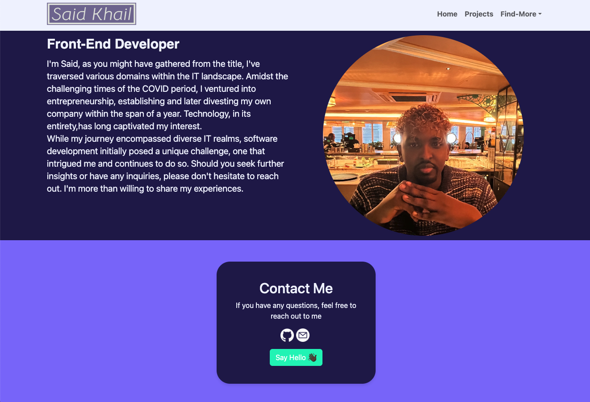

# My-React-Portfolio

## Description

Welcome to my Personal Proftfolio application, where I proudly showcase a diverse range of my projects. with a toolkit spanning Bootstrap, React-Bootstrap, CSS, Vanilla Javascript, Jquery,Node.js, Jest Testing and React. I've crafted this portfolio to embody both creativity and professionalism.

## Usage

1. Clone the repository to your local machine using:
   ```
   git clone git@github.com:SKhail/My-React-Portfolio.git
   ```
2. Navigate to the cloned directory
3. Install dependencies by running
   ```
   npm install
   ```
4. Start the Application by running:
   ```
   npm run dev
   ```
5. Screenshot shown below:

   

## Installation

1.  Clone the repository to your local machine
2.  Navigate to the directory where you want to clone the repository

    ```
    git clone git@github.com:SKhail/My-React-Portfolio.git
    ```

    ```
    npm install
    ```

3.  You can use the application

    ```
    npm run dev
    ```

## Feature

N/A

## Credits

N/A

## License

This project is licened under the MIT License.

[](https://opensource.org/licenses/MIT)

## Tests

N/A

## Resources

[https://react-bootstrap.netlify.app/docs/components/carousel/]

[https://react-bootstrap.netlify.app/docs/components/navbar/]

[https://vitejs.dev/guide/]

[https://colorhunt.co/palette/211951836fff15f5baf0f3ff]
